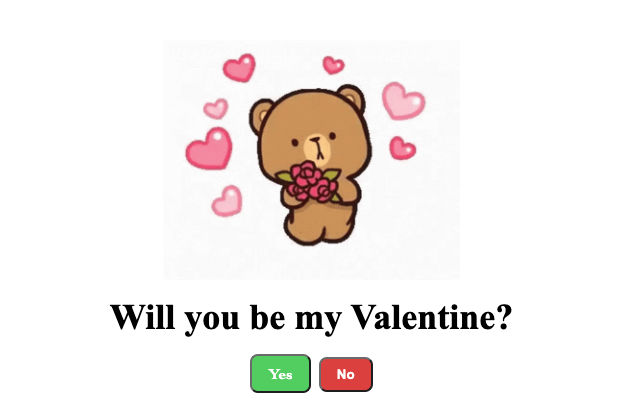

# Will you be my Valentine 💖

Love is in the air, and so is code! 💻

## Description

This React application is a Valentine's Day experiment featuring a cute bear and an invitation to be your Valentine. 

Trust me when I say your crush won't say NO!

It displays a playful question: "Will you be my Valentine?" accompanied by two response options: a "Yes" button and a "No" button. If the user tries to press "No," the button insists and cleverly avoids being clicked by saying changing no to a new response like "Are you sure" or"You're breaking my heart" and more, encouraging the user to eventually click "Yes." Upon agreeing, the webpage celebrates the acceptance with a cute GIF. Share some love and enjoy the animations!

### React + TypeScript + Vite

This template provides a minimal setup to get React working in Vite with HMR and some ESLint rules.

Currently, two official plugins are available:

- [@vitejs/plugin-react](https://github.com/vitejs/vite-plugin-react/blob/main/packages/plugin-react/README.md) uses [Babel](https://babeljs.io/) for Fast Refresh
- [@vitejs/plugin-react-swc](https://github.com/vitejs/vite-plugin-react-swc) uses [SWC](https://swc.rs/) for Fast Refresh